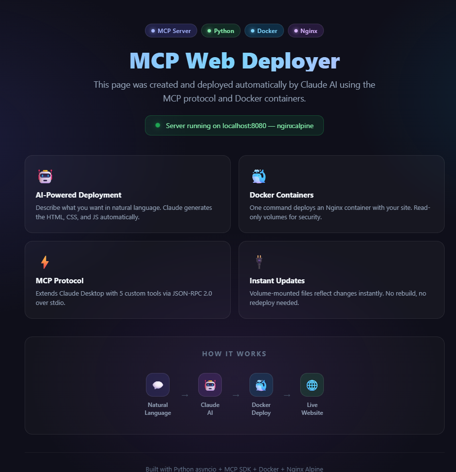

# MCP Web Deployer

<div align="center">


**MCP server that lets Claude AI deploy static websites through Docker containers**

</div>

---

## What It Does

You tell Claude what you want in plain language. Claude generates the HTML, deploys an Nginx container, and your site is live — all through the [Model Context Protocol](https://modelcontextprotocol.io).

```
"Create a landing page with a hero section and deploy it"
```

```
  User ──► Claude AI ──► MCP Server ──► Docker ──► Live Site
  (prompt)   (generates)   (deploys)    (nginx)   (localhost:8080)
```



## Features

- **Natural language to website** — describe what you want, Claude builds it
- **One-command deploy** — Nginx container with read-only volume mounts
- **Instant updates** — edit files, refresh browser, changes are live
- **5 MCP tools** — create, deploy, stop, status, list
- **Async Python** — non-blocking I/O with asyncio
- **Secure by default** — container isolation, no external port exposure

## Quick Start

### Prerequisites

- Python 3.8+
- Docker 20.10+
- [Claude Desktop](https://claude.ai/download)

### Install

```bash
git clone https://github.com/kratosvil/mcp-web-deployer.git
cd mcp-web-deployer
python -m venv venv

# Windows
.\venv\Scripts\Activate.ps1

# Linux/macOS
source venv/bin/activate

pip install -r requirements.txt
```

### Configure Claude Desktop

Add to your Claude Desktop config file:

| OS | Path |
|-----|------|
| Windows | `%APPDATA%\Claude\claude_desktop_config.json` |
| Linux | `~/.config/Claude/claude_desktop_config.json` |
| macOS | `~/Library/Application Support/Claude/claude_desktop_config.json` |

```json
{
  "mcpServers": {
    "web-deployer": {
      "command": "/absolute/path/to/venv/bin/python",
      "args": ["/absolute/path/to/src/server.py"]
    }
  }
}
```

Restart Claude Desktop, then try:

```
"Create an index.html with a welcome message and deploy the server"
```

Open `http://localhost:8080` to see your site.

## MCP Tools

| Tool | Description |
|------|-------------|
| `create_html` | Create an HTML file in `www/` with custom content |
| `deploy_server` | Launch Nginx container serving `www/` on a given port |
| `stop_server` | Stop and remove the Docker container |
| `server_status` | Check if the server is running, show port and uptime |
| `list_html_files` | List all HTML files with size and modification date |

## Architecture

```
Claude Desktop
     │
     │  MCP Protocol (JSON-RPC 2.0 via stdio)
     ▼
┌─────────────────────┐
│  MCP Server         │
│  (Python asyncio)   │
│                     │
│  5 registered tools │
└──────┬──────┬───────┘
       │      │
       ▼      ▼
   File I/O   Docker Engine
   (www/)     (nginx:alpine)
                  │
                  ▼
              localhost:8080
```

- **Protocol**: JSON-RPC 2.0 over stdio
- **Container**: `nginx:alpine` (~23MB, starts in <1s)
- **Volume**: `www/` mounted read-only at `/usr/share/nginx/html`
- **Port**: only binds to localhost (not accessible from network)

## Testing

```bash
# Run all 27 tests
pytest tests/ -v

# Run specific test groups
pytest tests/ -v -k "CreateHtml"
pytest tests/ -v -k "Deploy"
pytest tests/ -v -k "Status"
```

Tests use mocked Docker calls — no running Docker instance needed to run the test suite.

## Project Structure

```
mcp-web-deployer/
├── src/
│   └── server.py          # MCP server (5 tools, async)
├── tests/
│   └── test_server.py     # 27 tests with pytest
├── www/                   # HTML files served by Nginx
├── examples/
│   └── welcome.html       # Demo page
├── docs/
│   ├── ARCHITECTURE.md    # Technical deep-dive
│   ├── INSTALLATION.md    # Multi-platform setup guide
│   └── USAGE.md           # Usage guide with examples
├── scripts/
│   ├── setup.ps1          # Windows setup automation
│   └── start.ps1          # Windows startup script
├── requirements.txt
└── config.example.json
```

## Tech Stack

| Layer | Technology |
|-------|-----------|
| Client | Claude Desktop |
| Protocol | MCP (stdio, JSON-RPC 2.0) |
| Backend | Python 3.8+ / asyncio |
| Container | Docker / nginx:alpine |
| Testing | pytest / pytest-asyncio |

## Documentation

- [Architecture](docs/ARCHITECTURE.md) — system design, data flow, security model
- [Installation](docs/INSTALLATION.md) — step-by-step setup for Windows, Linux, macOS
- [Usage](docs/USAGE.md) — tool reference, examples, workflows, troubleshooting

## License

MIT
